# QuickMart Commerce Platform


A quick-commerce inspired shopping platform featuring intelligent product discovery, wishlist management, dynamic cart operations, coupon handling, delivery workflows, checkout simulation, and order tracking.
## 🚀 Live Demo

### Explore the Application

🔗 https://srthck.github.io/quickmart-commerce-platform/

### Key Areas to Test

- Product Search & Filtering
- Wishlist Management
- Shopping Cart Operations
- Coupon Application
- Delivery Selection
- Order Tracking System
- Customer Support Center

## Preview

### Hero Section

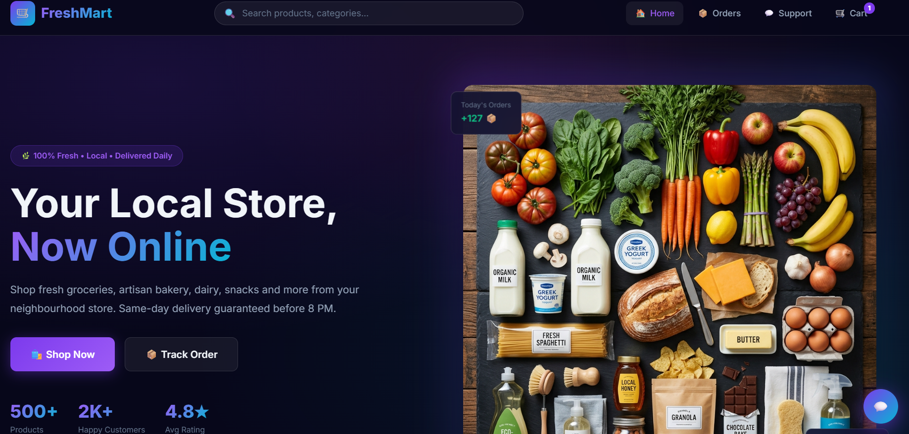

### Product Discovery & Filtering

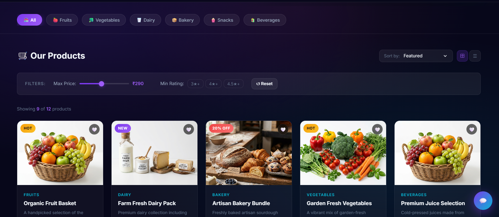

### Product Grid Experience

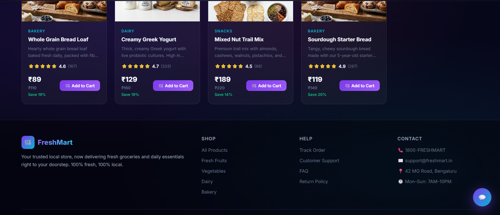

### Customer Support Assistant

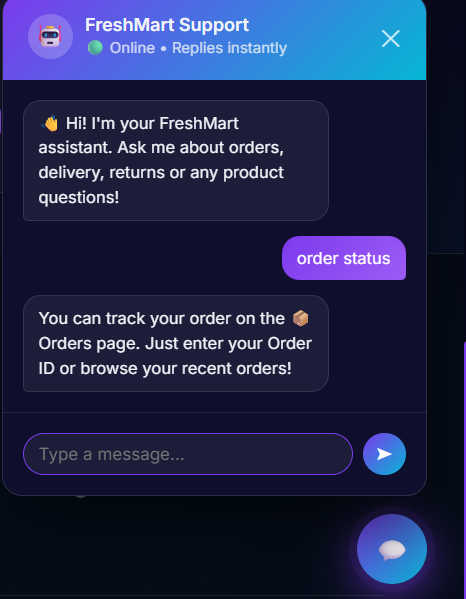

## Order Management & Tracking

### Track Orders Using Order IDs

Customers can track active orders using a dedicated tracking interface.

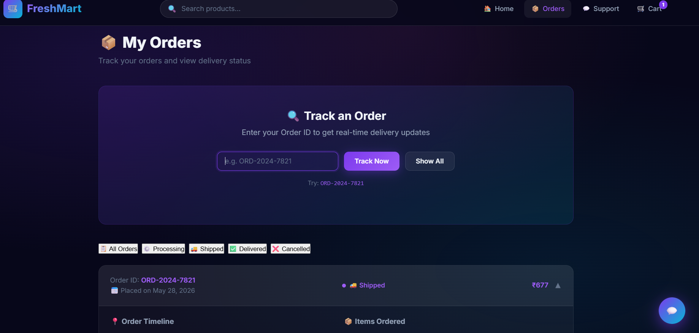

### Visual Order Timeline

Each order progresses through multiple fulfillment stages:

- Order Placed
- Processing
- Shipped
- Delivered

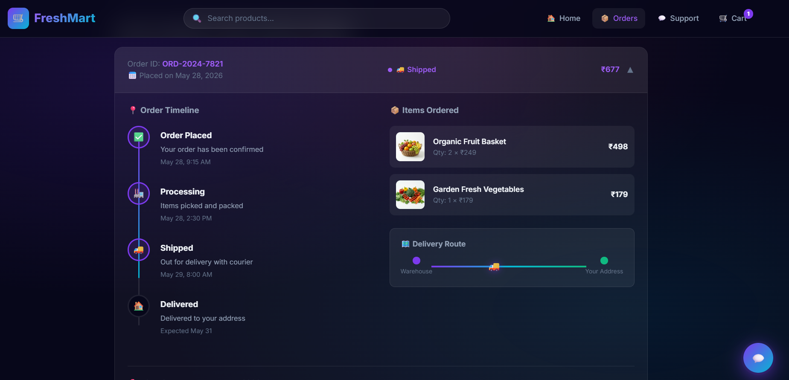

### Delivery Progress Visualization

The platform includes a delivery route visualization that simulates real-world shipment progress between warehouse and customer destination.

### Order History

Customers can review completed orders, purchased items, order values, and fulfillment history.

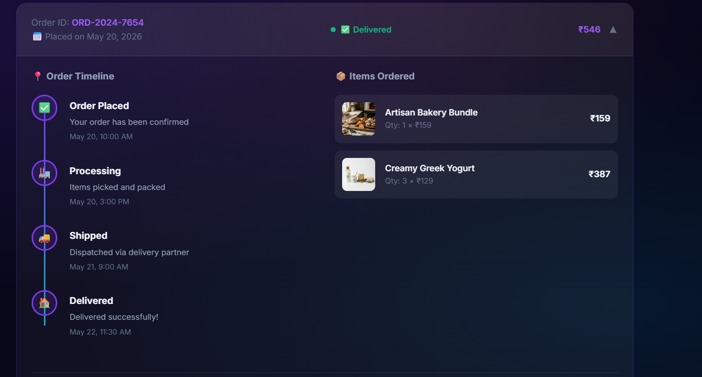

## Customer Support Center

### Multi-Channel Customer Support

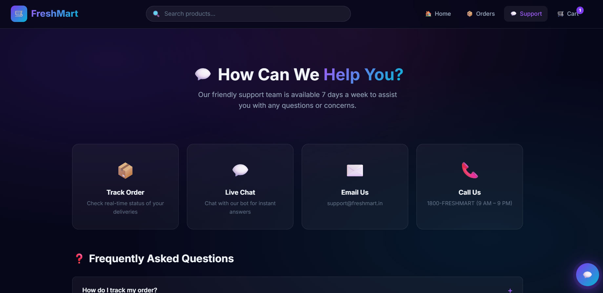

### Contact & Ticket Submission

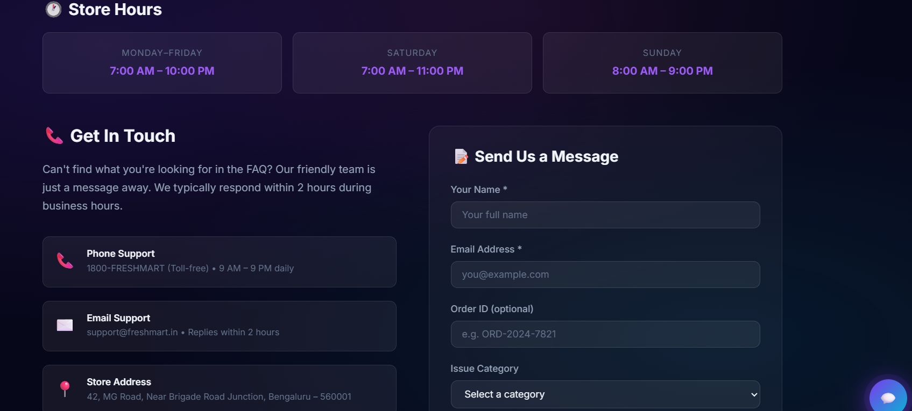

### Interactive FAQ System

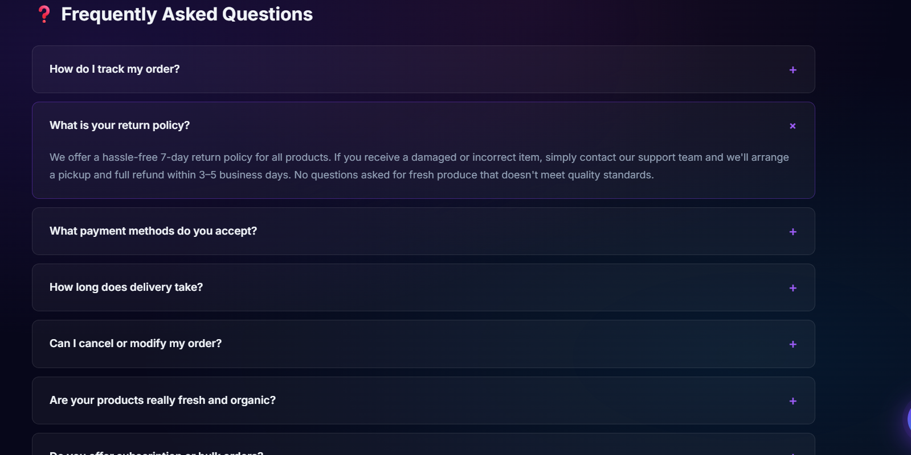

## Shopping Cart & Checkout

### Dynamic Cart Management

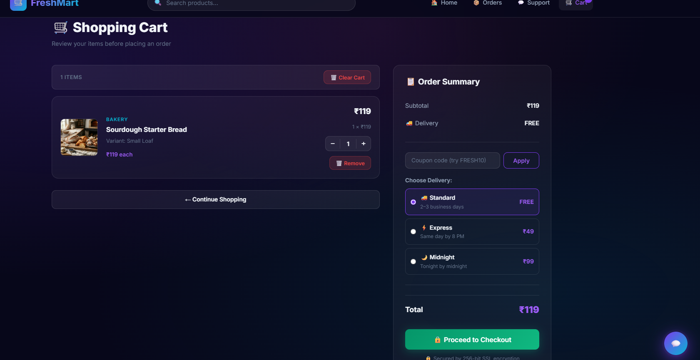

### Checkout & Delivery Selection

The platform supports multiple delivery methods, coupon application, and dynamic order calculations to simulate real-world checkout workflows.

### Quick-Commerce Inspired Shopping Experience Built with HTML, CSS & JavaScript

QuickMart Commerce Platform is a front-end commerce application inspired by modern quick-commerce and online grocery delivery platforms.

The project recreates the complete customer shopping journey — from product discovery and personalized browsing to cart management, checkout workflows, order tracking, and customer engagement features.

Unlike a traditional static storefront, QuickMart focuses on simulating real-world commerce workflows and user interactions that power modern retail platforms.

---

# Executive Summary

This project was designed to explore how modern commerce systems manage:

* Product discovery
* Customer engagement
* Shopping cart operations
* Promotional campaigns
* Checkout experiences
* Order lifecycle management
* Client-side state persistence

The application combines business-oriented workflows with interactive front-end engineering principles to deliver a realistic online shopping experience.

---

# Core Commerce Features

## Product Catalog System

The platform includes a structured product catalog containing:

* Multiple product categories
* Rich product metadata
* Product descriptions
* Ratings and review counts
* Stock availability
* Product badges
* Discount information
* Product variants

### Available Categories

* Fruits
* Vegetables
* Dairy
* Bakery
* Snacks
* Beverages

---

## Intelligent Product Discovery

Customers can quickly find products through multiple discovery mechanisms.

### Search Engine

* Real-time product search
* Keyword matching
* Fast product lookup experience

### Category Filtering

* Dynamic category selection
* Category-based product exploration

### Price Filtering

* Budget-focused product discovery
* Price range selection

### Rating Filtering

* Quality-based browsing experience

### Advanced Sorting

Products can be sorted by:

* Price: Low to High
* Price: High to Low
* Customer Rating
* Product Name
* Discount Percentage

---

# Product Experience

Each product includes:

* Product image
* Category information
* Dynamic pricing
* Original price comparison
* Discount visibility
* Product description
* Review metrics
* Product variants
* Availability indicators

Examples of supported variants:

* 500g
* 1kg
* 2kg
* Premium Editions
* Family Packs

---

# Customer Review System

The platform incorporates a review architecture featuring:

* Customer names
* Ratings
* Review titles
* Detailed review content
* Helpfulness indicators
* Review timestamps

This creates a more authentic shopping experience and simulates social proof mechanisms commonly used in production commerce applications.

---

# Wishlist Management

Customers can save products for future purchases through a dedicated wishlist system.

### Capabilities

* Add products to wishlist
* Remove products from wishlist
* Persistent wishlist storage
* Cross-session wishlist retention

Wishlist data is maintained using browser Local Storage.

---

# Shopping Cart Engine

The shopping cart system supports:

### Cart Operations

* Add products to cart
* Quantity management
* Product removal
* Variant selection
* Dynamic subtotal calculation
* Real-time cart updates

### Cart Intelligence

* Automatic cart badge updates
* Persistent cart storage
* Session recovery
* Dynamic state synchronization

Cart state is managed entirely on the client side using Local Storage.

---

# Promotional Coupon System

QuickMart includes a promotional discount engine to simulate real-world marketing campaigns.

### Supported Coupon Campaigns

* FRESH10
* SAVE50
* NEWUSER

### Features

* Discount validation
* Coupon application
* Dynamic pricing updates
* Promotional savings calculation

---

# Delivery Experience

The platform simulates multiple delivery workflows commonly found in modern quick-commerce applications.

### Delivery Options

#### Standard Delivery

Reliable scheduled delivery experience.

#### Express Delivery

Priority fulfillment for faster deliveries.

#### Midnight Delivery

Premium after-hours delivery experience.

Delivery selections dynamically affect the final checkout summary.

---

# Checkout Workflow

The checkout process includes:

* Cart validation
* Delivery selection
* Payment selection
* Order summary generation
* Final purchase confirmation

The workflow is designed to mirror modern commerce applications while remaining fully client-side.

---

# Order Management System

Customers can access and manage order history through a dedicated order tracking experience.

### Order Information

Each order contains:

* Order ID
* Purchase date
* Delivery address
* Product details
* Quantity information
* Pricing summary
* Estimated delivery date

---

# Order Lifecycle Tracking

QuickMart visualizes the complete order journey.

### Supported Statuses

* Pending
* Processing
* Shipped
* Delivered
* Cancelled

### Timeline Visualization

The order tracking system displays:

* Order confirmation
* Processing stage
* Shipping stage
* Delivery completion

This creates a realistic post-purchase experience.

---

# Customer Support Module

The application includes a dedicated support experience allowing customers to access assistance and support-related information.

---

# Notification System

QuickMart includes a toast notification architecture that provides:

* Success notifications
* User feedback messages
* Shopping confirmations
* Interaction acknowledgements

This improves usability and customer engagement.

---

# Persistent State Management

One of the key engineering aspects of the project is client-side state persistence.

### Local Storage Integration

The application stores:

* Shopping cart data
* Wishlist data
* Order history
* Customer interactions

This enables session continuity and creates a more realistic shopping experience.

---

# Technical Architecture

## Frontend Technologies

* HTML5
* CSS3
* JavaScript (ES6)

## Engineering Concepts Applied

* DOM Manipulation
* Event-Driven Programming
* State Management
* Component-Oriented Thinking
* Responsive Design Principles
* Data-Driven Rendering
* Browser Storage APIs
* User Experience Engineering

---

# Application Structure

```text
quickmart-commerce-platform/

├── index.html
├── product.html
├── cart.html
├── orders.html
├── support.html

├── css/
│   ├── style.css
│   ├── index.css
│   ├── product.css
│   ├── cart.css
│   └── orders.css

├── js/
│   ├── app.js
│   ├── index.js
│   ├── product.js
│   ├── cart.js
│   └── orders.js

├── images/
└── hero_banner.png
```

---

# What This Project Demonstrates

This project demonstrates practical understanding of:

* Commerce Platform Design
* Retail User Journeys
* Front-End State Management
* Product Discovery Systems
* Shopping Cart Architecture
* Customer Engagement Workflows
* Order Fulfillment Experiences
* Responsive Web Development

---

# Future Roadmap

Planned improvements include:

* User Authentication
* Backend APIs
* Database Integration
* Payment Gateway Integration
* Inventory Management
* Admin Dashboard
* Real-Time Order Updates
* User Profiles
* Address Management
* Recommendation Engine

---
# Commerce Workflows Implemented

The platform recreates a complete quick-commerce customer journey rather than focusing only on product listings.

```text
Product Discovery
        ↓
Advanced Search & Filtering
        ↓
Wishlist Management
        ↓
Shopping Cart Operations
        ↓
Coupon Application
        ↓
Delivery Selection
        ↓
Checkout Simulation
        ↓
Order Creation
        ↓
Order Tracking
        ↓
Customer Support
```

This workflow was designed to simulate how modern retail and grocery delivery platforms manage the customer lifecycle from product discovery to post-purchase support.

---

# Order Management & Tracking

FreshMart includes a dedicated order management experience allowing customers to monitor purchases after checkout.

### Features

* Order ID based tracking
* Order history management
* Status-based order filtering
* Delivery progress visualization
* Detailed order information
* Purchased item summaries
* Dynamic order status updates

### Supported Order States

* Pending
* Processing
* Shipped
* Delivered
* Cancelled

### Order Timeline System

The platform visualizes the fulfillment process through a structured timeline showing:

* Order Placed
* Processing
* Shipping
* Delivery Completion

This creates a realistic post-purchase customer experience.

---

# Customer Support Center

FreshMart includes a dedicated customer support ecosystem inspired by modern retail platforms.

### Support Channels

Customers can receive assistance through:

* Order Tracking
* Live Chat Assistant
* Email Support
* Phone Support

### Interactive FAQ System

The platform includes an accordion-based FAQ knowledge base covering:

* Order Tracking
* Returns & Refunds
* Payment Methods
* Delivery Timelines
* Product Quality
* Order Modifications

### Support Request Workflow

Customers can submit structured support requests containing:

* Customer Information
* Email Address
* Order Reference ID
* Issue Category
* Detailed Support Message

### Business Information

The support center also provides:

* Store Hours
* Contact Information
* Customer Care Availability
* Store Address Details

---
# Shopping Cart & Checkout Experience

FreshMart includes a dynamic shopping cart system designed to simulate modern quick-commerce checkout workflows.

### Cart Management

Customers can:

* Add products to cart
* Update product quantities
* Remove individual products
* Clear the entire cart
* Manage product variants
* Review cart contents before checkout

### Dynamic Order Summary

The platform automatically calculates:

* Product subtotal
* Delivery charges
* Coupon discounts
* Final payable amount

All calculations update in real time based on customer actions.

### Promotional Coupon Engine

Supported promotional campaigns include:

* FRESH10
* SAVE50
* NEWUSER

The coupon system dynamically validates and applies discounts during checkout.

### Delivery Options

Customers can choose between multiple fulfillment experiences:

#### Standard Delivery

* Free Delivery
* Estimated 2–3 business days

#### Express Delivery

* Same-day delivery
* Premium pricing

#### Midnight Delivery

* Overnight fulfillment
* Premium delivery fee

### Checkout Workflow

The checkout experience includes:

* Cart validation
* Coupon application
* Delivery selection
* Dynamic pricing updates
* Purchase confirmation simulation

This workflow was designed to replicate the customer journey found in modern grocery delivery and retail commerce platforms.


# Author

## Sarthak K

B.Tech Student | Software Developer

Interested in building scalable software products, commerce platforms, and user-centric digital experiences through practical engineering and continuous learning.

This version is what I would actually put on GitHub. It keeps all the strengths of your project, removes repetition, matches the screenshots, and reads like a professional product repository rather than an internship task.